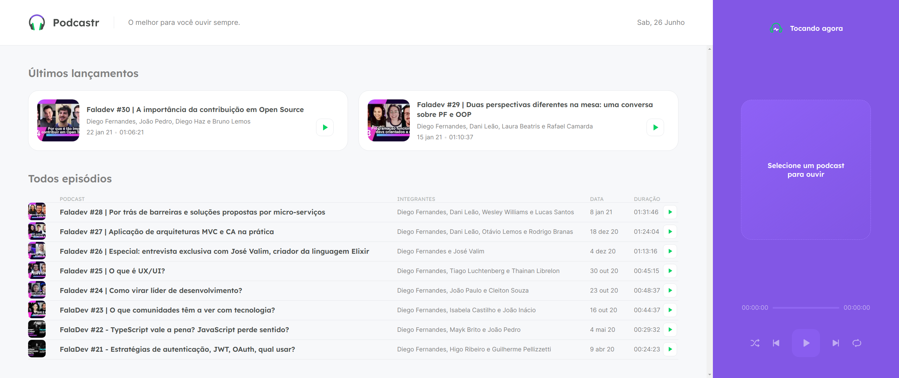

# Podcastr



> Podcastr é uma aplicação criada com Next.js na NLW 5 da rocketseat, onde foi ensinado como consumir uma API e como mostra-la em tela utilizando o conceito de SSG. A aplicação mostra todos os episódios dos podcasts gravados pela empresa em seu canal do YouTube.

## 💻 Pré-requisitos

Antes de começar, verifique se você atendeu aos seguintes requisitos:

<!---Estes são apenas requisitos de exemplo. Adicionar, duplicar ou remover conforme necessário--->

- Você instalou a versão mais recente do `< node / npm ou yarn >`
- Você tem uma máquina `<Windows / Linux / Mac >`.

## 🚀 Instalando o projeto <Podcastr> na sua maquina

Para instalar o projeto, siga estas etapas:

Linux e macOS:

```bash
git clone https://github.com/alextfonseca/podcastr_NLW_5.git
$ cd podcastr_NLW_5
$ yarn ou npm
$ yarn start ou npm start
$ yarn server
```

Windows:

```bash
git clone https://github.com/alextfonseca/podcastr_NLW_5.git
$ cd podcastr_NLW_5
$ yarn ou npm
$ yarn start ou npm start
$ yarn server
```

## 🧾 Usando o projeto

Com o projeto Podcastr você pode ouvir todos os episódios gravados no canal do YouTube da rocketseat:

# <a href="https://github.com/alextfonseca/podcastr_NLW_5">Acesse o projeto</a>

## 😄 Me siga nas redes sociais<br>

<p align="left">

  <a href="https://www.linkedin.com/in/alex-teixeira-da-fonseca-5a99931a2/" alt="Linkedin">
  </a>

  <a href="https://wa.me/+5511976184659?text=Olá%20Alex" alt="WhatsApp">
  </a>

  <a href="https://www.instagram.com/devalextf/?hl=pt-br" alt="Instagram">
  </a>
</p>
